# Tello Selfie Assistant with OpenVino

Using human pose estimation to pilot a Tello drone and make selfies ! The program gets the video stream from the Tello camera, processes it to make the drone aim the person's face and recognize poses to control the drone (moving forward/backward, right/left, landing, taking a picture,...).

The code of this repository relies on the [Intel&reg; distribution of OpenVINO&trade; toolkit](https://software.intel.com/en-us/openvino-toolkit). OpenVINO (Open Visual Inference and Neural network Optimization) is a free toolkit facilitating the optimization of deep learning models and deployment onto Intel hardware.  Note that the current release of this repository is intented to be run on a Intel&reg; CPU (deployment on iGPU, Intel® Movidius™ Vision Processing Unit (VPU) could be considered as well in future releases). I have made another release of this project but relying on the original release of Openpose and that needs a powerful GPU to run fast enough. Thanks to OpenVINO, the Tello Selfie Assistant can work on a much broader variety of hardware configuration. 

## How It Works

The Ryze Tello from DJI is toy quadcopter that can take 5MP images or shoot 720p videos with its frontal camera.
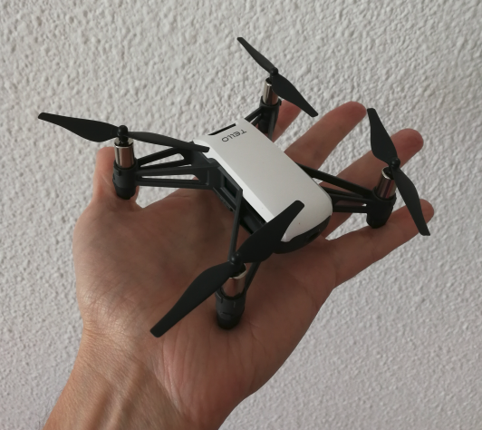

 A key strength of the Tello is the availability of libraries that allow us to write and run our own program on a computer to interact with the drone. Via such a library, our program can get the video stream from the frontal camera and send flight commands to the drone.

Nothing prevent us to analyse the content of the video frames and decide accordingly the commands we send back to the drone. This is exactly what we are doing here !
On each frame received from the Tello, we apply a human pose estimation model. If no pose is found, we make the drone rotate until it finds one. If a pose is found, we make the drone move in order to put the face in the center of the image.

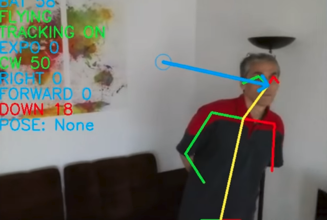

In the image above, a person is detected and his pose estimated. We know where his nose is, and we want to bring the nose in the image center represented by a small blue circle. The blue arrow symbolizes the move needed. Here, we will send to the drone a "Rotate right" command, with a little bit of "Go down".

But that's not all. In addition to keeping the drone centered on the face, we also try to recognize if the current pose corresponds to a predefined pose, and when appropriate trigger an associated command.

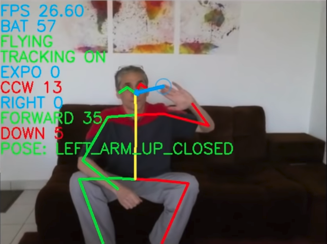

For instance, in the image above, the left arm is up (the left hand keypoint is above the neck keypoint) and closed (the angle between arm and forearm is < 90°). This a predefined pose. When detected, we make the drone go forward.

The following table lists the predefined poses/actions:

|   |   |
|---|---|
||Pose: Left arm up closed<br>Action: **go forward** |
|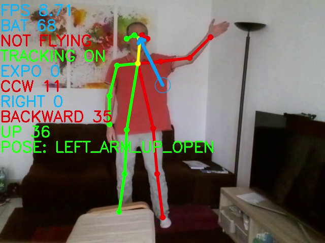|Pose: Left arm up open<br>Action: **go backward** |
|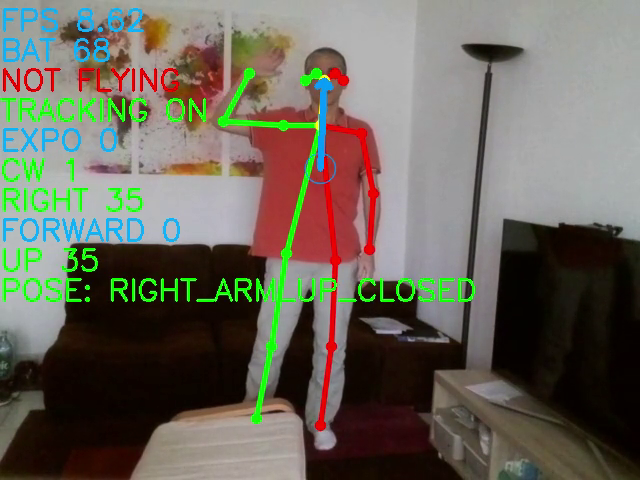|Pose: Right arm up closed<br>Action: **go left** (from person point of view) |
|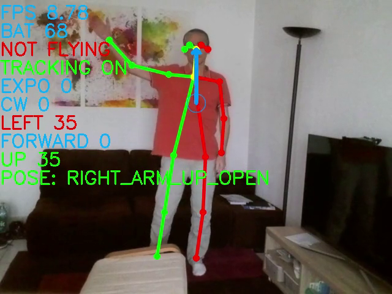|Pose: Right arm up open<br>Action: **go right** (from person point of view) |
|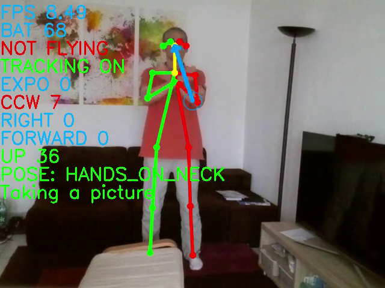|Pose: Hands on neck (keypoints of hands MUST be under the neck keypoint)<br>Action: wait 2 seconds (give time to the user to change his pose), then **take a picture**. The picture is transfered into a local directory of the computer.|
|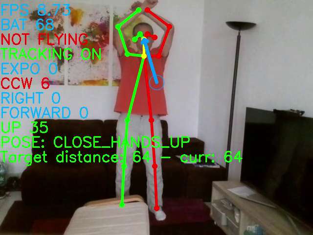|Pose: Both hands together above the head<br>Action: **enter/leave locked distance mode**<br>In locked distance mode, the drone tries to keep a constant distance to the body. As the drone has no direct way to measure a real distance, it tries instead to keep constant indirect distances (like the shoulder width in pixels).|
|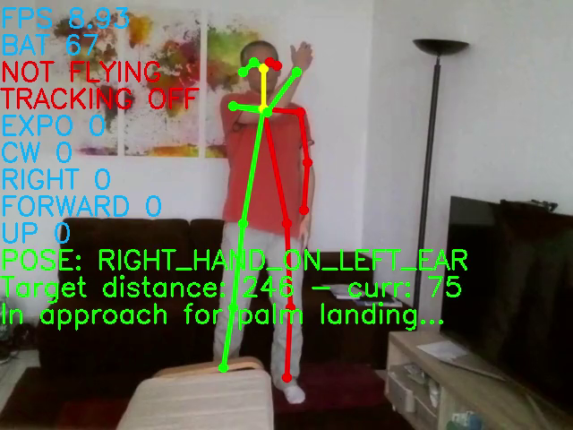|Pose: Right hand up on the left side (the human pose model used has hard way detecting the hand if too close of the ear)<br>Action: **initiate a palm landing**<br>The drone approaches the body and when close enough, waits the person places his hand below, then softly lands onto the palm.|
|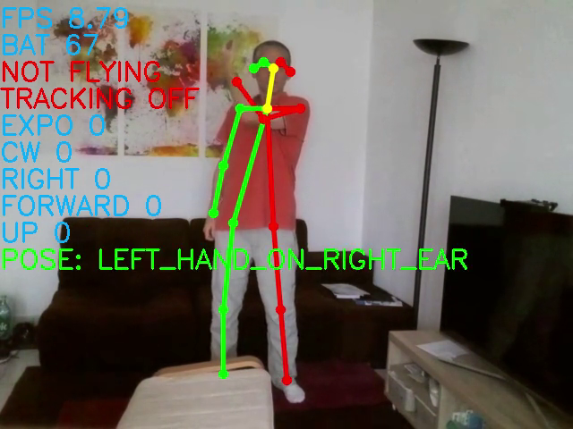|Pose: Left hand up on right side (the human pose model used has hard way detecting the hand if too close of the ear)<br>Action: **initiate an immediate landing**<br>The drone immediately lands, so use with care !|

Note that you can also use your keyboard to control the drone (see the Running chapter for the list of keys/actions).
But most of the time, you probably don't want to use the keyboard, specially if you don't stand nearby. 
<br>To make the drone take-off without using the keyboard, I have implemented a little trick (called Morse Code trick), which allows to trigger commands on the program via the drone camera. By covering/uncovering the camera with a finger you "generate" beeps. 


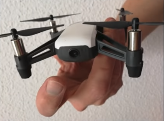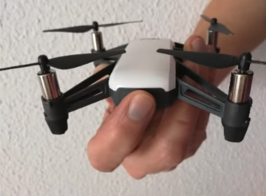

Beeps can be short or long, depending on the time the camera is covered. Successive beeps can make a Morse code that correspond to a predefined associated action. Currently, 2 actions are predefined:
| Morse code | Action |
|---|---|
| . . .| Throw and go |
| - - -| Delayed take-off. Once the action is triggered, you have 5 seconds to put the drone on a flat surface and keep your fingers away from the propellers ! |
|||


## Prerequisites


### Hardware 
Same prerequisites as for [OpenVINO for CPUs](https://docs.openvinotoolkit.org/latest/_docs_install_guides_installing_openvino_linux.html#development_and_target_platform) :


>* 6th-10th Generation Intel® Core™ processors (I have personally tested on Core i7-7700K)
>* Intel® Xeon® v5 family
>* Intel® Xeon® v6 family


### Software
This project relies on a lot of modules/librairies. To make installation much simpler, I have created a docker image that can be installed on linux. So **you need to have installed Docker Engine on your linux**. See prequisites there : https://docs.docker.com/install/linux/docker-ce/binaries/#prerequisites

## Installation

I suppose that you have already installed Docker Engine. You just need to pull the project docker image from the docker hub:
```
docker pull geaxgx/tello_humanpose_openvino:latest
```
This image was generated from the Dockerfile of this repository. It may take time to pull the image (size around 1.2GB).

### Content of the docker image
1. Installation of Ubuntu 18.04
2. Installation of a few  packages (compiler, cmake, interface to sound drivers, git,...)
3. Clone of this github repository
4. Installation of python via miniconda. I have choosen miniconda because install of pyav is much simpler with conda than with pip !
5. Download and installation of the following packages of OpenVINO:
    - Inference Engine Development Kit
    - Inference Engine Runtime for  Intel CPU
    - OpenCV (optimized for Intel processors)
6. Installation the following python packages:
    - TelloPy : Tello drone controller from https://github.com/hanyazou/TelloPy. I have slightly modified the version so that I can run it in 2 processes. This modified version is in the TelloPy directory of this repository;
    - simple-pid : a simple and easy to use PID controller (https://github.com/m-lundberg/simple-pid);
    - pynput : to read keyboard events (the keyboard can also be used to pilot the drone);
    - pygame: to play sounds (when poses are recognized, gives a audio feedback).

## Human Pose Estimation model

The model used is [human-pose-estimation-0001](https://docs.openvinotoolkit.org/latest/_models_intel_human_pose_estimation_0001_description_human_pose_estimation_0001.html) from the Open Model Zoo. This is a multi-person 2D pose estimation network (based on the OpenPose approach) with tuned MobileNet v1 as a feature extractor. For every person in an image, the network detects a human pose: a body skeleton consisting of keypoints and connections between them. The pose may contain up to 18 keypoints: ears, eyes, nose, neck, shoulders, elbows, wrists, hips, knees, and ankles. The model is located in "models" directory in the IR (intermediate representation) format directly useable by the OpenVINO inference engine.

## Running

### Run the docker container
On your docker host, you first need to authorize access to the X server :

```
xhost +local:
```
Choose and create if needed a directory on your host where the pictures taken by the Tello will be saved. Make the environment variable PICTURES_DIR point to this directory. Example:
```
PICTURE_DIR=/tmp/pictures
mkdir -p $PICTURE_DIR
```
Then run the docker image :

```
docker run -it --rm -e DISPLAY=${DISPLAY} -v /tmp/.X11-unix:/tmp/.X11-unix --network host --device /dev/snd  -e PULSE_SERVER=unix:${XDG_RUNTIME_DIR}/pulse/native -v ${XDG_RUNTIME_DIR}/pulse/native:${XDG_RUNTIME_DIR}/pulse/native -v ~/.config/pulse/cookie:/root/.config/pulse/cookie -v $PICTURE_DIR:/work/pictures --name tello geaxgx/tello_humanpose_openvino:latest
```
Alternatively, if you have a webcam and want to test pose estimation on the video stream of your webcam, add the argument `--device=/dev/video#:/dev/video#` after having replaced `#` by the id associated with your webcam.
For example, for a default webcam : 
```
docker run -it --rm -e DISPLAY=${DISPLAY} -v /tmp/.X11-unix:/tmp/.X11-unix --network host --device /dev/snd  -e PULSE_SERVER=unix:${XDG_RUNTIME_DIR}/pulse/native -v ${XDG_RUNTIME_DIR}/pulse/native:${XDG_RUNTIME_DIR}/pulse/native -v ~/.config/pulse/cookie:/root/.config/pulse/cookie -v $PICTURE_DIR:/work/pictures --device=/dev/video0:/dev/video0 --name tello geaxgx/tello_humanpose_openvino:latest
```
By running one of the two commands above, you get access to a shell. The working directory (/work) contains a clone of this repository. From there you can run one of the python script.

### 1. tello_selfie_assistant.py

```
python tello_selfie_assistant.py
```

```
usage: tello_selfie_assistant.py [-h] [-l LOG_LEVEL] [-1] [--no_sound]
                                 [-k KEYBOARD_LAYOUT] [-s HEIGHT_SIZE]

optional arguments:
  -h, --help            show this help message and exit
  -l LOG_LEVEL, --log_level LOG_LEVEL
                        select a log level (info, debug,...)
  -1, --monoprocess     use 1 process (instead of 2)
  --no_sound            Desactivate sound
  -k KEYBOARD_LAYOUT, --keyboard_layout KEYBOARD_LAYOUT
                        Your keyboard layout (QWERTY or AZERTY)
                        (default=QWERTY)
  -s HEIGHT_SIZE, --height_size HEIGHT_SIZE
                        Network input layer height size. The smaller the
                        faster (default=256)
```
#### `--height_size HEIGHT_SIZE `
Before a video frame is processed by the human pose model, the frame is first resized to the input layer size (*input_height*, *input_width*). By default *input_height* = 256, and *input_width* = *input_height * frame_width / frame_height*. The model can be [reshaped](https://docs.openvinotoolkit.org/latest/_docs_IE_DG_ShapeInference.html#usage_of_reshape_method) by giving a new value to *input_height*. If you give a smaller value to *input_height*, the inference will be faster, but the pose estimation could be less accurate. My advice: start with the default value (256) and if the FPS is to slow, decrease by 10%, and so on, until you find the best compromise.

#### `--monoprocess`
You shouldn't need to use this option. By default (without this option), the application uses 2 processes: one process receives the video frames sent by the drone, one process runs the pose estimation, recognizes poses and sends flight commands back to the drone. With the option '--monoprocess', only one process manages communications in both directions, and the FPS is a bit smaller.

#### `--no_sound`
You shouldn't need to use this option. It is convenient to have an audio feedback when some actions are triggered.

#### `--keyboard_layout KEYBOARD_LAYOUT`
In case you want to use your keyboard to pilot the drone, use this argument to select your keyboard layout. Here is the mapping key/action : 

| QWERTY | AZERTY | Action|
|---|---|---|
|w|z| Go forward |
|s|s| Go backward|
|a|q| Go left|
|d|d| Go right|
|q|a| Rotate left|
|e|e| Rotate right|
|&leftarrow;|&leftarrow;| Rotate left (faster)|
|&rightarrow;| &rightarrow;| Rotate right (faster)|
|&uparrow;|&uparrow;| Go up|
|&downarrow;|&downarrow;| Go down|
|Tab|Tab|Take off|
|Backspace|Backspace| Landing|
|p|p| Palm landing|
|t|t| Toggle tracking|
|h|h| Toggle human pose estimation|
|Enter|Enter| Take a picture|
|0,1,2,3,4,5|0,1,2,3,4,5| Set video encode rate (0 = auto adjust, from 1 to 5 = from 1Mb/s to 4Mb/s)|
|7|7| Decrease exposure|
|8|8| Auto exposure|
|9|9| Increase exposure|

> **NOTE**: when starting tello_selfie_assistant.py, you need to wait 10-15s before getting the video stream from the drone. During that delay, you will get errors like below. You can safely ignore them.
```
[ ERROR ] non-existing PPS 0 referenced                                                                                   
[ ERROR ] non-existing PPS 0 referenced                                                                                   
[ ERROR ] decode_slice_header error                                                                                       
[ ERROR ] no frame! 
```
>Then 2 windows (if you are in multiprocess mode) appear, one shows the raw stream from the drone, the other displays the result of the processing on the last frame plus the HUD :<br>
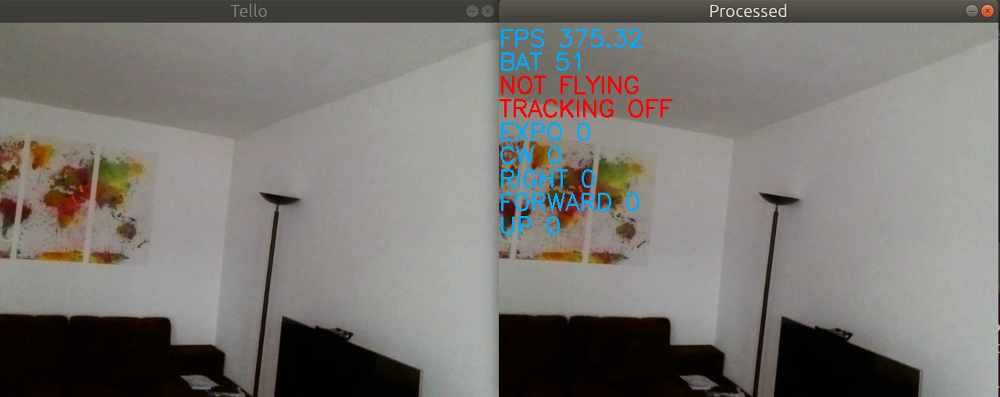


### 2. human_pose.py

This script is the module doing the pose estimation. If you have a webcam and have run the container with `--device=/dev/video0:/dev/video0` as explaned above, you can directly apply the human pose estimation on your webcam stream.
```
python human_pose.py -i /dev/video0
```

### 3. test_gestures.py

Like for `human_pose.py`, you can use your webcam video stream to test and practice the different poses predefined in `tello_selfie_assistant.py`. Simply run: 
```
python test_gestures.py -i /dev/video0
```
<br>

# Enjoy !